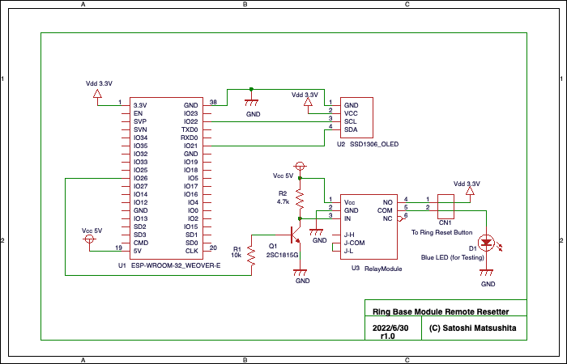

# WiFiRingbaseReset

## Devices 
* ESP32 VE32 - devkit - ESP32-WROVER-E (Arduino)
* OLED SSD1306

## Circuit Diagram
Arduino

In the diagram, 'CN1' is connected to an LED for testing. It is connected to the both terminal of the reset switch of 'Ring Base Station' during operation.

## Arduino IDE download link
[https://www.arduino.cc/en/software/](https://www.arduino.cc/en/software/)

## Arduino Source Code
The Arduino code is 'WiFiRingbaseReset/WiFiRingbaseReset.ino'.

>[!Note]
>* WiFi SSID and password are hard coded in WiFiRingbaseReset.ino.
>* Websocket is used to push the reset status to the web browser.
>* It periodically resets itself (a day in the current source), which recovers from the lost WiFi connection.
>* Status (Reset Status, A progress bar to show liveness, IP address) are displayed on the OLED display of the device.

## USB Serial board to write ESP32
　[https://amzn.to/3Ac7aK9](https://amzn.to/3Ac7aK9) 　HiLetgo FT232RL FTDI Mini USB to TTL Serial Converter Adapter Module 3.3V 5.5V FT232R Breakout FT232RL USB to Serial Mini USB to TTL Adapter Board for Arduino

## Arduino tool setting for ESP32 write on Macbook
 /dev/cu.usbserial-0001  115200 baud, newline

